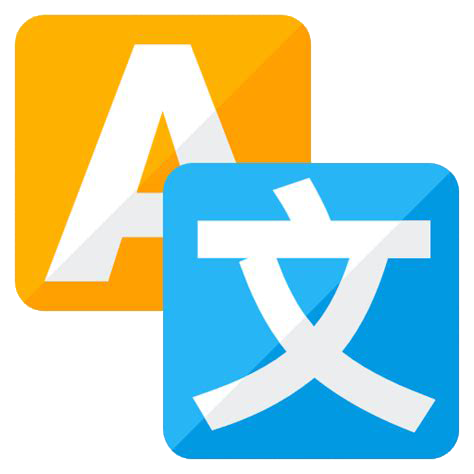

<h1 align="center">
   
    
   
  Translation Command
   
</h1>

1. Set your desired config parameters in "/Addons/Configs/translate.yml"
2. Create the channel for logging translations to (e.g. translations)
3. Do "npm i @vitalets/google-translate-api"
